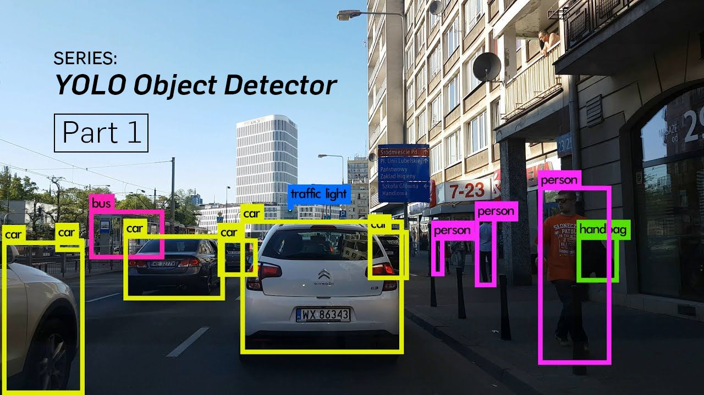

# Object Detection using YOLO-v3 Deep Learning Model Trained on COCO Dataset in Python

## 1. Objective

In this project, we shall demonstrate the Deep Learning (DL) inference using a DL object detection model, YOLO-v3, which has already been trained on the COCO dataset. 

## 2. YOLO-v3

* You Only Look Once (YOLO) is a state-of-the-art, real-time object detection model. It is not straight forward to reasonably train the YOLO-v3 network from scratch, due to several reasons including: 

  * Lack of large volume of annotated data 
  * Lack of sufficiently powerful computing resources 

* Instead of exploring the training of YOLO-v3 from scratch we use an already trained model retrieved from the following source: 

  * Trained YOLO-v3 model source: https://github.com/xiaochus/YOLOv3 
  * This model has been trained on the COCO dataset: 
    * Source: https://cocodataset.org/#home 
  * COCO is a large-scale object detection, segmentation, and captioning dataset. 
  * 330K images (>200K labeled) 
  * 80 object categories, including typical objects such as vehicles, people, cats, dogs, etc. 

In this work, we shall demonstrate how to deploy the trained YOLO-v3 model to detect objects of interest:

## 3. Development

* Project: Object Detection using YOLO-v3:
  * The objective of this project is to demonstrate how to use the state of the art in object detection!

* It is not straight forward to reasonably train the YOLO-v3 network from scratch, due to several reasons including:
  * Lack of large volume of annotated data
  * Lack of sufficiently powerful computing resources
  * Instead of exploring the training of YOLO-v3 from scratch we use an already trained model retrieved from the following source:
    * Trained YOLO-v3 model source: https://github.com/xiaochus/YOLOv3
    * Original YOLO-v3 paper: YOLOv3: An Incremental Improvement
      * Source: https://arxiv.org/abs/1804.02767
    * This model has been trained on the COCO dataset:
    * Source: https://cocodataset.org/#home
      * COCO is a large-scale object detection, segmentation, and captioning dataset.
        * 330K images (>200K labeled)
        * 80 object categories, including typical objects such as vehicles, people, cats, dogs, etc.

* In this work, we shall demonstrate how to deploy the trained model to detect objects of interest:
  * Author: Mohsen Ghazel (mghazel)
  * Date: April 9th, 2021
  
### 3.1. Step 1: Imports and global variables

#### 3.1.1. Python import

<pre style="color:#000020;background:#e6ffff;font-size:10px;line-height:1.5;">#------------------------------------------------------
# Python imports and environment setup
#------------------------------------------------------
# opencv
import cv2
# numpy
import numpy as np
# matplotlib
import matplotlib.pyplot as plt
import matplotlib.image as mpimg

#------------------------------------------------------
# Import the YOLO model from the downlaoded
# pretraiend model subfolder (model)
#------------------------------------------------------
from model.yolo_model import YOLO

# input/output OS
import os 

# date-time to show date and time
import datetime
# import time
import time

# to display the figures in the notebook
%matplotlib inline

#------------------------------------------
# Test imports and display package versions
#------------------------------------------
# Testing the OpenCV version
print("OpenCV : ",cv2.__version__)
# Testing the numpy version
print("Numpy : ",np.__version__)

OpenCV :  4.5.1
Numpy :  1.19.2
</pre>

#### 3.1.2. Global variables:

* The YOLO model expects two parameters:
  * Confidence threshold: Only objects with detection confidence higher than this value are kept and the rest are discarded
  * NMS threshold: This is used by the NMS algorithm to combine overlapping detections.

<pre style="color:#000020;background:#e6ffff;font-size:10px;line-height:1.5;">#------------------------------------------------------
# Confidence threshold: 
#------------------------------------------------------
# Only objects with detection confidence higher than this 
# value are kept and the rest are discarded
#------------------------------------------------------
DETECTION_CONFIDENCE_THRESHOLD = 0.50
#------------------------------------------------------
# NMS threshold: 
#------------------------------------------------------
# This is used by the NMS algorithm to combine overlapping 
# detections
#------------------------------------------------------
NMS_THRESHOLD = 0.50
</pre>

### 3.2. Step 2: Define utility functions:
#### 3.2.1. A function pre-process images by resizing them as needed:

<pre style="color:#000020;background:#e6ffff;font-size:10px;line-height:1.5;">def process_image(img):
    """Resize, reduce and expand image.

&nbsp;&nbsp;&nbsp;&nbsp;# Argument:
&nbsp;&nbsp;&nbsp;&nbsp;&nbsp;&nbsp;&nbsp;&nbsp;img: original image.

&nbsp;&nbsp;&nbsp;&nbsp;# Returns
&nbsp;&nbsp;&nbsp;&nbsp;&nbsp;&nbsp;&nbsp;&nbsp;image: ndarray(64, 64, 3), processed image.
&nbsp;&nbsp;&nbsp;&nbsp;"""
    image = cv2.resize(img, (416, 416),
                       interpolation=cv2.INTER_CUBIC)
    image = np.array(image, dtype='float32')
    image /= 255.
    image = np.expand_dims(image, axis=0)

    return image
</pre>

#### 3.2.2. A function to get the class names:

* The YOLO-v3 model has been pre-trained on the COCO dataset, which has 80 classes
* This function retrieves the names of the 80 classes in the COCO data set by reading them from the configuration file

<pre style="color:#000020;background:#e6ffff;font-size:10px;line-height:1.5;">def get_classes(file):
    """Get classes name.

&nbsp;&nbsp;&nbsp;&nbsp;# Argument:
&nbsp;&nbsp;&nbsp;&nbsp;&nbsp;&nbsp;&nbsp;&nbsp;file: classes name for database.

&nbsp;&nbsp;&nbsp;&nbsp;# Returns
&nbsp;&nbsp;&nbsp;&nbsp;&nbsp;&nbsp;&nbsp;&nbsp;class_names: List, classes name.

&nbsp;&nbsp;&nbsp;&nbsp;"""
    with open(file) as f:
        class_names = f.readlines()
    class_names = [c.strip() for c in class_names]

    return class_names
</pre>

#### 3.2.3. A visualization function:
* This function overlays the detection results on this image, including:
  * detection bounding-boxes
  * class name
  * detection confidence

<pre style="color:#000020;background:#e6ffff;font-size:10px;line-height:1.5;">def draw(image, boxes, scores, classes, all_classes):
    """Draw the boxes on the image.

&nbsp;&nbsp;&nbsp;&nbsp;# Argument:
&nbsp;&nbsp;&nbsp;&nbsp;&nbsp;&nbsp;&nbsp;&nbsp;image: original image.
&nbsp;&nbsp;&nbsp;&nbsp;&nbsp;&nbsp;&nbsp;&nbsp;boxes: ndarray, boxes of objects.
&nbsp;&nbsp;&nbsp;&nbsp;&nbsp;&nbsp;&nbsp;&nbsp;classes: ndarray, classes of objects.
&nbsp;&nbsp;&nbsp;&nbsp;&nbsp;&nbsp;&nbsp;&nbsp;scores: ndarray, scores of objects.
&nbsp;&nbsp;&nbsp;&nbsp;&nbsp;&nbsp;&nbsp;&nbsp;all_classes: all classes name.
&nbsp;&nbsp;&nbsp;&nbsp;"""
    for box, score, cl in zip(boxes, scores, classes):
        x, y, w, h = box

        top = max(0, np.floor(x + 0.5).astype(int))
        left = max(0, np.floor(y + 0.5).astype(int))
        right = min(image.shape[1], np.floor(x + w + 0.5).astype(int))
        bottom = min(image.shape[0], np.floor(y + h + 0.5).astype(int))

        cv2.rectangle(image, (top, left), (right, bottom), (255, 0, 0), 2)
        cv2.putText(image, '{0} {1:.2f}'.format(all_classes[cl], score),
                    (top, left - 6),
                    cv2.FONT_HERSHEY_SIMPLEX,
                    0.6, (0, 0, 255), 1,
                    cv2.LINE_AA)

        print('class: {0}, score: {1:.2f}'.format(all_classes[cl], score))
        print('box coordinate x,y,w,h: {0}'.format(box))

    print()
</pre>

#### 3.2.4. Inference function from an image:

* This function deploys the trained YOLO-v3 model to detect any potential objects of interest.

<pre style="color:#000020;background:#e6ffff;font-size:10px;line-height:1.5;">def detect_image(image, yolo, all_classes):
    """Use yolo v3 to detect images.

&nbsp;&nbsp;&nbsp;&nbsp;# Argument:
&nbsp;&nbsp;&nbsp;&nbsp;&nbsp;&nbsp;&nbsp;&nbsp;image: original image.
&nbsp;&nbsp;&nbsp;&nbsp;&nbsp;&nbsp;&nbsp;&nbsp;yolo: YOLO, yolo model.
&nbsp;&nbsp;&nbsp;&nbsp;&nbsp;&nbsp;&nbsp;&nbsp;all_classes: all classes name.

&nbsp;&nbsp;&nbsp;&nbsp;# Returns:
&nbsp;&nbsp;&nbsp;&nbsp;&nbsp;&nbsp;&nbsp;&nbsp;image: processed image.
&nbsp;&nbsp;&nbsp;&nbsp;"""
    pimage = process_image(image)

    start = time.time()
    boxes, classes, scores = yolo.predict(pimage, image.shape)
    end = time.time()

    print('time: {0:.2f}s'.format(end - start))

    if boxes is not None:
        draw(image, boxes, scores, classes, all_classes)

    return image
</pre>

#### 3.2.5. Inference function from a video:

* This function deploys the trained YOLO-v3 model to detect any potential objects of interest from a video file
* Basically, each video frame is processes independently, using the previous function.

<pre style="color:#000020;background:#e6ffff;font-size:10px;line-height:1.5;">def detect_video(video, yolo, all_classes):
    """Use yolo v3 to detect video.

&nbsp;&nbsp;&nbsp;&nbsp;# Argument:
&nbsp;&nbsp;&nbsp;&nbsp;&nbsp;&nbsp;&nbsp;&nbsp;video: video file.
&nbsp;&nbsp;&nbsp;&nbsp;&nbsp;&nbsp;&nbsp;&nbsp;yolo: YOLO, yolo model.
&nbsp;&nbsp;&nbsp;&nbsp;&nbsp;&nbsp;&nbsp;&nbsp;all_classes: all classes name.
&nbsp;&nbsp;&nbsp;&nbsp;"""
    video_path = os.path.join("videos", "test", video)
    camera = cv2.VideoCapture(video_path)
    cv2.namedWindow("detection", cv2.WINDOW_AUTOSIZE)

    # Prepare for saving the detected video
    sz = (int(camera.get(cv2.CAP_PROP_FRAME_WIDTH)),
        int(camera.get(cv2.CAP_PROP_FRAME_HEIGHT)))
    fourcc = cv2.VideoWriter_fourcc(*'mpeg')

    
    vout = cv2.VideoWriter()
    vout.open(os.path.join("videos", "res", video), fourcc, 20, sz, True)

    while True:
        res, frame = camera.read()

        if not res:
            break

        image = detect_image(frame, yolo, all_classes)
        cv2.imshow("detection", image)

        # Save the video frame by frame
        vout.write(image)

        if cv2.waitKey(110) &amp; 0xff == 27:
                break

    vout.release()
    camera.release()
    
</pre>

### 3.3. Step 3: Instantiate the YOLO-v3 model:
* We are now ready to instantiate the pre-trained YOLO-v3 model before it can be deployed:
  * The YOLO model expects two parameters:
    * Confidence threshold: Only objects with detection confidence higher than this value are kept and the rest are discarded
    * NMS threshold: This is used by the NMS algorithm to combine overlapping detections.

<pre style="color:#000020;background:#e6ffff;font-size:10px;line-height:1.5;"># Instantiate the YOLO model class
yolo = YOLO(DETECTION_CONFIDENCE_THRESHOLD, NMS_THRESHOLD)
# this is the file containing the names of all the classes
file = 'data/coco_classes.txt'
# get all the names of the classes
all_classes = get_classes(file)
</pre>

### 3.4. Step 4: Deploy the trained YOLO-v3 model to detect objects of interest:
#### 3.4.1. Detection from images:
* First we can deploy it on individual input images to detect and localize potential objects of interest
  * All test images in the test images folder will be processed
  * We can get test images from open source site:
  * Unsplash: https://unsplash.com/

<pre style="color:#000020;background:#e6ffff;font-size:10px;line-height:1.5;">#------------------------------------------------------
# 4.1) Set test images folder name
#------------------------------------------------------
test_images_folder = 'images/test/'
#------------------------------------------------------
# 4.2) itetate over all the images in the test images 
#      folder
#------------------------------------------------------
for filename in os.listdir(test_images_folder):
    #------------------------------------------------------
    # 4.3) read the test image
    #------------------------------------------------------
    img = cv2.imread(os.path.join(test_images_folder,filename))
    if img is not None:
        #------------------------------------------------------
        # 4.4) deploy the YOLO model to conduct inference in 
        #      the image
        #------------------------------------------------------
        img = detect_image(img, yolo, all_classes)
        #------------------------------------------------------
        # 4.5) Visualize the detections results
        #------------------------------------------------------
        # create a figure
        plt.figure(figsize=(8, np.uint8(8 * img.shape[0]/img.shape[1])))
        # visualize detection results
        plt.subplot(111)
        plt.title("YOLO-v3: Detection results", fontsize=12)
        plt.xticks([]), plt.yticks([])
        plt.imshow(cv2.cvtColor(img, cv2.COLOR_BGR2RGB))
</pre>

#### 3.4.12. Detection from videos:
* We can deploy the trained YOLO-v3 model on a video to detect and localize potential objects of interest:
  * Basically, each frame of the video is parsed and processed separately as an image, just like we illustrated above.

<pre style="color:#000020;background:#e6ffff;font-size:10px;line-height:1.5;">#------------------------------------------------------
# detect videos one at a time in videos/test folder   
#------------------------------------------------------
# 4.2.1) Set test video folder and file name
#------------------------------------------------------
# test-video folder
test_video_folder = 'images/test/'
# test-video file name
test_video_fname = 'library1.mp4'
# test-video full-path file name
test_video_file_path = test_video_folder + test_video_fname 
#------------------------------------------------------
# 4.2.2) call detect_video() to conduct inference on 
#         the video
#------------------------------------------------------
detect_video(test_video_file_path, yolo, all_classes)
</pre>

### 3.4. Step 4: Display a successful execution message:

<pre style="color:#000020;background:#e6ffff;font-size:10px;line-height:1.5;"># display a final message
# current time
now = datetime.datetime.now()
# display a message
print('Program executed successfully on: '+ str(now.strftime("%Y-%m-%d %H:%M:%S") + "...Goodbye!\n"))

Program executed successfully on: 2021-04-14 21:39:22...Goodbye!
</pre>

## 4. Sample YOLO object detection results

* We have tested the YOLO-v3 model on 10 test images, contains various objects of interest. The detection results are illustrated next for each test image.

### 4.1. Test image # 1:

<pre style="color:#000020;background:#e6ffff;font-size:10px;line-height:1.5;">time: 1.78s
class: dog, score: 0.99
box coordinate x,y,w,h: [ 10.19209296  14.36614296  86.29040748 132.3982138 ]
class: dog, score: 0.95
box coordinate x,y,w,h: [126.09061539   6.01810643  74.22350317 146.36979657]
class: dog, score: 0.56
box coordinate x,y,w,h: [81.35105833 62.04934654 61.20964855 82.47159237]
class: cat, score: 0.53
box coordinate x,y,w,h: [198.27343404  63.17662293  53.06311816  79.39320123]
</pre>

### 4.2. Test image # 2:

<pre style="color:#000020;background:#e6ffff;font-size:10px;line-height:1.5;">time: 0.74s
class: person, score: 0.99
box coordinate x,y,w,h: [368.21359396 104.02029443 121.8848601  120.1177237 ]
class: person, score: 0.97
box coordinate x,y,w,h: [ 50.01873523 111.84529734 139.93528485 141.13240802]
class: person, score: 0.83
box coordinate x,y,w,h: [ 36.13579646  51.83125204  62.23230809 158.29805338]
class: person, score: 0.62
box coordinate x,y,w,h: [166.49897397  66.85848141  58.9142479  106.41536546]
</pre>

### 4.3 Test image # 3:

<pre style="color:#000020;background:#e6ffff;font-size:10px;line-height:1.5;">time: 0.74s
class: person, score: 0.99
box coordinate x,y,w,h: [378.28749418 326.94270372 121.24058604 305.88562575]
class: person, score: 0.98
box coordinate x,y,w,h: [194.84049082 341.5541026  109.87009108 291.49284735]
class: person, score: 0.97
box coordinate x,y,w,h: [ -2.07313523 329.88191319 111.28226668 296.5332661 ]
class: person, score: 0.97
box coordinate x,y,w,h: [ 99.36891496 326.99353135 117.07406491 303.14106911]
class: person, score: 0.70
box coordinate x,y,w,h: [281.08209372 328.79640794 151.02022886 306.41904584]
</pre>

### 4.4. Test image # 4:

<pre style="color:#000020;background:#e6ffff;font-size:10px;line-height:1.5;">time: 0.80s
class: horse, score: 0.99
box coordinate x,y,w,h: [ 68.49596649  97.66224182 116.75174534 193.6813184 ]
class: horse, score: 0.98
box coordinate x,y,w,h: [259.71484184 138.50968283  81.99092746 119.73992506]
</pre>

### 4.5. Test image # 5:

<pre style="color:#000020;background:#e6ffff;font-size:10px;line-height:1.5;">time: 0.82s
class: horse, score: 0.99
box coordinate x,y,w,h: [ -2.93928385  85.70314649 113.22645098 148.47420788]
class: horse, score: 0.99
box coordinate x,y,w,h: [230.75139523  75.36754668 262.8532052  250.40971935]
class: horse, score: 0.96
box coordinate x,y,w,h: [152.32335031  79.1682272  130.95849752 242.19710863]
class: horse, score: 0.90
box coordinate x,y,w,h: [ 88.25491369 101.32178074 106.2919721  194.65964341]
</pre>

### 4.6. Test image # 6:

<pre style="color:#000020;background:#e6ffff;font-size:10px;line-height:1.5;">time: 0.71s
class: person, score: 0.99
box coordinate x,y,w,h: [287.1645689  482.89136589  90.47405422 220.44807673]
class: car, score: 0.59
box coordinate x,y,w,h: [ 61.97722256 494.72030997 128.77330184  70.26270591]
</pre>

### 4.7. Test image # 7:

<pre style="color:#000020;background:#e6ffff;font-size:10px;line-height:1.5;">time: 0.77s
class: person, score: 1.00
box coordinate x,y,w,h: [187.65594482  82.93733287  91.79075241 306.85243368]
class: horse, score: 1.00
box coordinate x,y,w,h: [396.35887146 137.40119696 215.85384369 208.32020402]
class: dog, score: 1.00
box coordinate x,y,w,h: [ 61.19189739 263.38934135 145.36686897  88.4316597 ]
</pre>

### 4.8. Test image # 8:

<pre style="color:#000020;background:#e6ffff;font-size:10px;line-height:1.5;">time: 0.73s
class: person, score: 0.98
box coordinate x,y,w,h: [225.50240159 102.00662017  77.20900327 151.62935683]
class: person, score: 0.89
box coordinate x,y,w,h: [106.22136295 108.16646779  66.88002497 155.51600531]
class: bicycle, score: 1.00
box coordinate x,y,w,h: [214.48674798 169.38857824 126.11605227 115.49647996]
class: bicycle, score: 0.77
box coordinate x,y,w,h: [ 84.21652764 172.78498912 110.63914001  97.43866879]
class: car, score: 1.00
box coordinate x,y,w,h: [343.9591229  127.53708968 152.92595327  77.33121413]
class: car, score: 0.95
box coordinate x,y,w,h: [ 48.66480827 126.89756724 172.94928432  93.92557389]
</pre>

### 4.9. Test image # 9:

<pre style="color:#000020;background:#e6ffff;font-size:10px;line-height:1.5;">time: 0.86s
class: person, score: 0.96
box coordinate x,y,w,h: [349.51111674 179.73068959 108.53108019 156.0712916 ]
class: person, score: 0.88
box coordinate x,y,w,h: [ 35.07959098 179.21235001  60.12298167 146.15605992]
class: person, score: 0.54
box coordinate x,y,w,h: [ 79.5147121  180.1177125   49.46985096 134.8184858 ]
class: bicycle, score: 0.96
box coordinate x,y,w,h: [160.18867493 215.96660542 106.28129542  61.67598841]
class: car, score: 0.95
box coordinate x,y,w,h: [130.0984025  178.52714539 156.98941052  49.25055121]
class: car, score: 0.91
box coordinate x,y,w,h: [334.85984802 181.99032462 147.12804556  41.20300182]
</pre>

### 4.10. Test image # 10:

<pre style="color:#000020;background:#e6ffff;font-size:10px;line-height:1.5;">time: 0.77s
class: bicycle, score: 0.54
box coordinate x,y,w,h: [271.56883478 474.45206344 101.01432353  58.80256556]
class: car, score: 0.98
box coordinate x,y,w,h: [362.14998364 348.10010344 129.40327823 101.34838521]
class: car, score: 0.83
box coordinate x,y,w,h: [144.69975233 318.83762777 166.34090245  84.78889614]
</pre>

5. Analysis

Although the YOLO-v3 is considered as a state of the art deep learning object detection model, its performance is far from perfect:

It failed to detected several objects of interest, which appear clearly to the human eye
This may be due to the lack of diversity in the training data for certain classes
It also confused some classes, such as the cats and dogs in the first test images.
This yet another evidence that there is still much room for improvement for deep learning to become a reliable and consistent solution.

## 6. Future Work

* We plan to explore the following related issues:

  * Get more insights of some of the possible reasons behind the false negatives
  * Test the model on an annotated dataset and assess its performance using quantitative metrics such as:
    * Accuracy
    * Precision-recall (PR) curve
    * ROC curve
    * Read the original YOLO-v3 reference paper to understand the details of YOLO-v3 [9].

## 7. References

1. Larry Xiaochus. (April 14, 2021). YOLOv3. https://github.com/xiaochus/YOLOv3 
2. Joseph Redmon, (April 14, 2021). Ali Farhadi. YOLOv3: An Incremental Improvement. https://arxiv.org/abs/1804.02767
3. Joseph Chet Redmon. (April 14, 2021). YOLO: Real-Time Object Detection. https://pjreddie.com/darknet/yolo/ 
4. Microsoft. (April 14, 2021). COCO dataset. https://cocodataset.org/#home 
5. Ayoosh Kathuria. (April 14, 2021). How to implement a YOLO (v3) object detector from scratch in PyTorch: Part 1. https://blog.paperspace.com/how-to-implement-a-yolo-object-detector-in-pytorch/ 
6. Ayoosh Kathuria. (April 14, 2021). How to implement a YOLO (v3) object detector from scratch in PyTorch: Part 2. https://blog.paperspace.com/how-to-implement-a-yolo-v3-object-detector-from-scratch-in-pytorch-part-2/ 
7. Ayoosh Kathuria. (April 14, 2021). How to implement a YOLO (v3) object detector from scratch in PyTorch: Part 3. https://blog.paperspace.com/how-to-implement-a-yolo-v3-object-detector-from-scratch-in-pytorch-part-3/ 
8. Ayoosh Kathuria. (April 14, 2021). How to implement a YOLO (v3) object detector from scratch in PyTorch: Part 4. https://blog.paperspace.com/how-to-implement-a9. yolo-v3-object-detector-from-scratch-in-pytorch-part-4/ 
9. Ayoosh Kathuria. (April 14, 2021). How to implement a YOLO (v3) object detector from scratch in PyTorch: Part 5. https://blog.paperspace.com/how-to-implement-a-yolo-v3-object-detector-from-scratch-in-pytorch-part-5/ 
10. Joseph Redmon, Ali Farhadi. (April 14, 2021). YOLOv3: An Incremental Improvement. https://pjreddie.com/media/files/papers/YOLOv3.pdf

